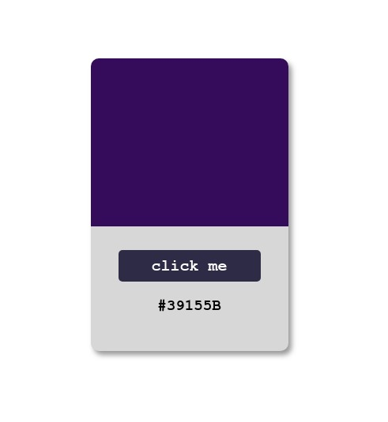

# Generator-Color

Es un pequeño ejercicio del funcionamiento del useState con react.js

  

Se genera un color al azar con forme se preciona el boton.

## Puedes ver el ejercicio en:

https://mariwrios.github.io/generator-color/

## Instrucciones:

- Clonas o descargas el repositorio.

- Haces un npm install

- Ejecutas yarn start

¡Y esta listo! Espero les guste y que tengan un lindo día.

#### Getting Started with Create React App

This project was bootstrapped with [Create React App](https://github.com/facebook/create-react-app).
